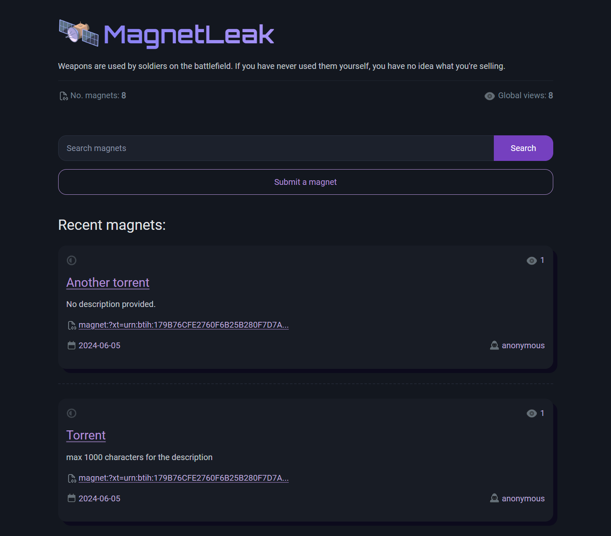

# MagnetLeak

  

Welcome to MagnetLeak - A Web App dedicated to share torrent magnets without censorship and JS free...

## Technologies Used

- **Flask:** Python Web framework for the backend.
- **Python:** Python Programming Language. 
- **HTML, CSS:** Front-end technologies for an interactive user experience.
- **PicoCSS:** Not bloated CSS framework and very lightweight. 
- **SQLite:** Database for storing magnets, views, users...

## Installation

1. Clone the repository: `https://github.com/currentlyonciawatchlist/MagnetLeak.git`
2. `cd MagnetLeak`
3. (optional) Create a python virtual environment. 
4. Install dependencies: `pip install -r requirements.txt`
5. Change the settings in the `app.py`.
6. Run the application (in development mode only): `python app.py`

## Deploy

See this [guide](https://dev.to/brandonwallace/deploy-flask-the-easy-way-with-gunicorn-and-nginx-jgc) for deploying the application in a linux server using Nginx and Gunicorn.

## Admin

See `/admin` for deleting posts.

## Disclaimer

This project is for educational purposes only. Any actions and or activities related to the material contained within this project is solely your responsibility. I assume no liability and are not responsible for any misuse or damage caused by this program.

## Contact

Created by [Nabil Et-taqy](https://github.com/nabilettaqy) - feel free to contact me!
